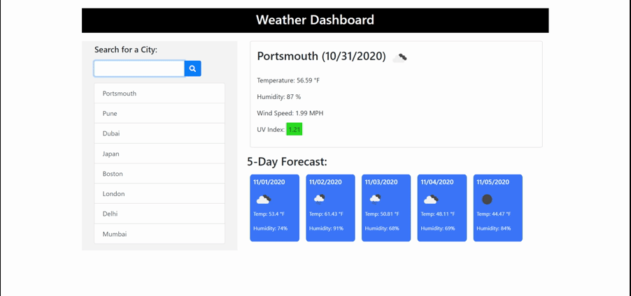
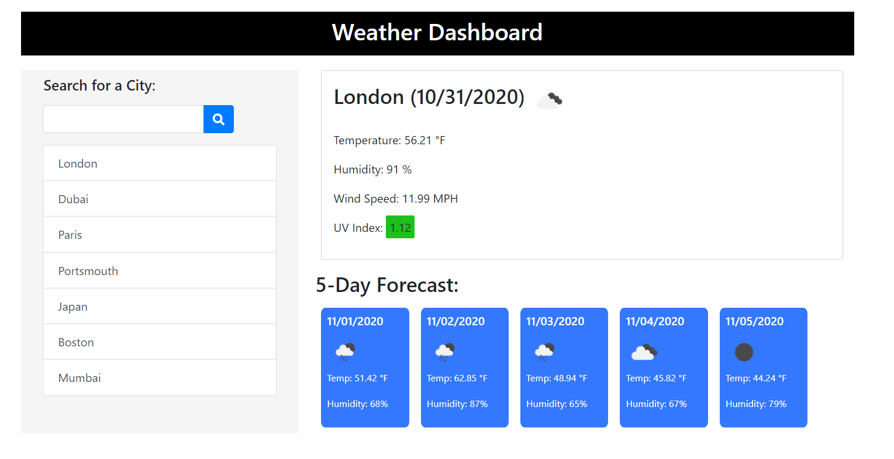

# weather-dashboard
A weather application that shows the current and 5-day forecast weather for a location, built primarily using AJAX

## User Story

```
AS A traveler
I WANT to see the weather outlook for multiple cities
SO THAT I can plan a trip accordingly
```

## Acceptance Criteria

```
GIVEN a weather dashboard with form inputs
WHEN I search for a city
THEN I am presented with current and future conditions for that city and that city is added to the search history
WHEN I view current weather conditions for that city
THEN I am presented with the city name, the date, an icon representation of weather conditions, the temperature, the humidity, the wind speed, and the UV index
WHEN I view the UV index
THEN I am presented with a color that indicates whether the conditions are favorable, moderate, or severe
WHEN I view future weather conditions for that city
THEN I am presented with a 5-day forecast that displays the date, an icon representation of weather conditions, the temperature, and the humidity
WHEN I click on a city in the search history
THEN I am again presented with current and future conditions for that city
WHEN I open the weather dashboard
THEN I am presented with the last searched city forecast

```

## Description

This application is a weather dashboard that has the following features:
 - It provides the users the ability to search and view the current and future weather conditions for any city in the world.  
 - The current weather condition section displays the city name, today's date, an icon representation of weather conditions, the temperature, the humidity, the wind speed, and the UV index.
 - UV Index is color coded to indicate whether the conditions are favorable, moderate or severe.
   UV Index value <= 2 is considered favorable
   UV Index value 3-7 is considered moderate
   UV Index value > 8 is considered extreme/severe
 - The future weather condition section displays the 5-day forecast that displays the date, an icon representation of weather conditions, the temperature, and the humidity.
 - The user can also view the search history list of all the past cities that have been searched for. Clicking on any of the city within the list will also display the weather conditions alongside.

## Technologies used
- HTML, CSS, Javascript, JQuery, Ajax, Moment.js, client-side storage


## Application Development

- The application uses the [OpenWeather API](https://openweathermap.org/api) third-party API to retrieve weather data for cities. 
- The application will run in the browser and has a clean, polished and responsive user interface.
- The application features dynamically updated HTML and CSS powered by Javascript code.
- The application uses the browser's local storage to store and retreive the Search History list, and displays with the most recently searched city at the top of the list.
- The application ensures that no duplicates are added to the search city list, but searching again still updates the placement of the city to the top of the list.
- The application also handles the scenario when a search button is simply clicked without any value in input box. It does so by NOT proceeding with sending the API request.
- The application uses the Bootstrap CSS framework for a few components as well as for quick styling.

## Additional Code Considerations

- Refactored and reorganized the code for better presentation.
- Added comments/pseudo-code to help understand the logic.
- Used semantic HTML for search engine optimization and accessibility, wherever possible.
- Used the W3C MarkUp Validation service (https://validator.w3.org/) to validate the HTML file and no errors were reported.


## For Review

* Deployed Application URL:  https://jesaldm.github.io/weather-dashboard/.
* Github Repository URL: https://github.com/JesalDM/weather-dashboard/
* Application functionality demo: 
* Screenshots : 
